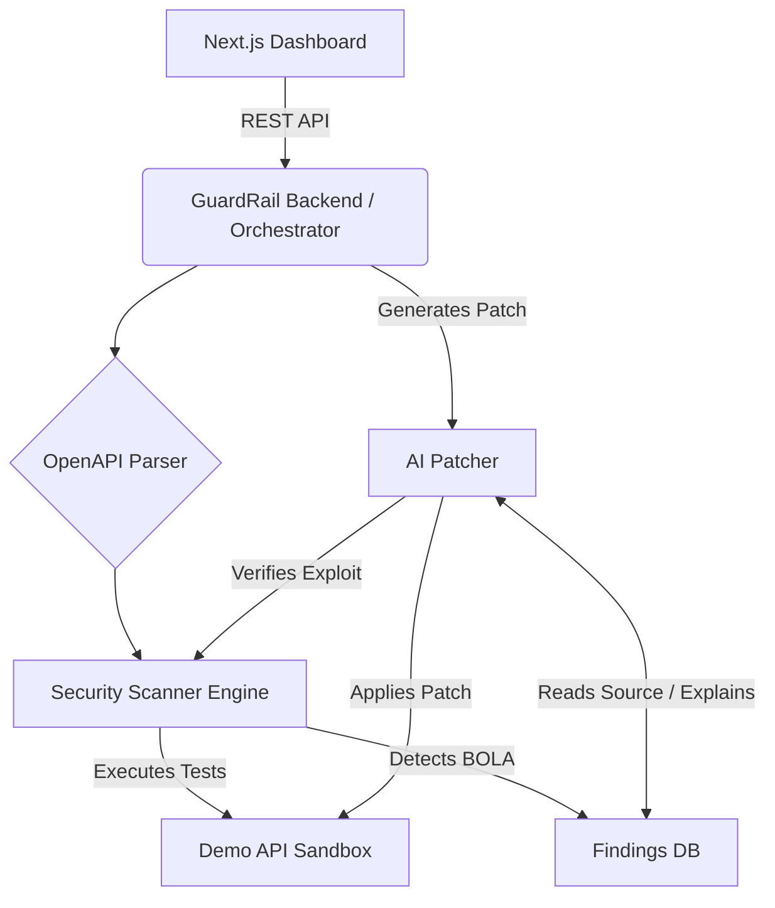

# GuardRail AI

GuardRail AI is an AI-powered API security testing and self-healing platform. It parses OpenAPI specifications, automatically generates and executes security test cases in a sandbox, detects vulnerabilities (like BOLA/IDOR), uses an LLM to explain the issue, generates a code patch, and verifies the fix.

## Architecture



## Features
- **BOLA / IDOR Detection:** Reasons about object ownership across different test identities (User A vs User B).
- **Broken Authentication Detection:** Detects unprotected endpoints that expose sensitive data.
- **Mass Assignment Detection:** Tests for unauthorized privilege escalation via injected fields.
- **Self-Healing:** Uses an LLM to generate a unified diff patch, applies it, and re-runs the exploit to ensure the vulnerability is fixed.

## Getting Started

### Prerequisites
- Docker and Docker Compose
- API Key for LLM (Google Gemini, OpenAI, or Anthropic)

### Configuration
1. Copy `.env.example` to `.env`:
   ```bash
   cp .env.example .env
   ```
2. Add your preferred API key to `.env` (e.g., `GEMINI_API_KEY=your_key_here`) and set `LLM_PROVIDER=gemini`.

### Running Locally
Run the entire stack using Docker Compose:
```bash
make up
# or
docker compose up --build
```

- **Dashboard:** http://localhost:3000
- **GuardRail API:** http://localhost:8000
- **Demo API (Vulnerable Target):** http://localhost:8080

### Trying the Demo
1. Open the Dashboard at `http://localhost:3000`.
2. Click **Try Demo Scan**. This will parse the demo API, execute test cases, and discover a BOLA vulnerability, Broken Auth, and Mass Assignment.
3. Click **Review Finding** on the BOLA vulnerability.
4. Click **Generate AI Fix** to get an explanation and patch.
5. Click **Apply & Verify Fix** to apply the patch to the sandbox, hot-reload the server, and re-run the exploit to confirm it is blocked (HTTP 403).

## Development
- `apps/web`: Next.js 13 frontend (Tailwind, React)
- `apps/api`: FastAPI backend, scanner engine, and AI patcher
- `apps/demo-api`: Intentionally vulnerable FastAPI application

## GitHub PR Integration (Placeholder)
The UI provides a "Create Pull Request" button after a patch is verified. In a fully configured environment, this would use GitHub's API to branch, commit the patch, and open a PR with the verification results.
